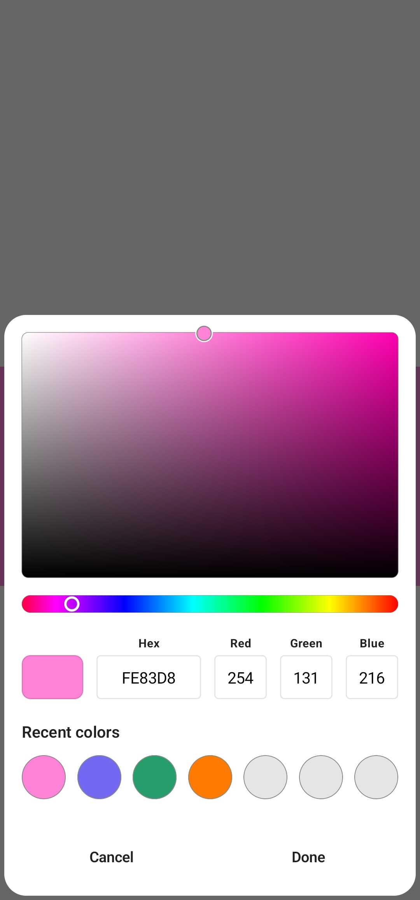

[](https://jitpack.io/#sachinkumar53/ColorPicker)       
# Color Picker - Compose 
This is a color picker library for android written in Kotlin using Jetpack Compose. The library is very simple, easy to use and lightweight.

## Screenshots



## Demo
See how it works by downloading the [Sample.apk](https://github.com/sachinkumar53/ColorPicker/raw/master/sample.apk)
## Implementation
Add the JitPack maven repository. Add these to `settings.gradle` file.

```gradle
dependencyResolutionManagement {
    ...
    repositories {
        ...
        maven { url 'https://jitpack.io' }
    }
}
```

Add color picker library dependency to your app level `build.gradle` file
```gradle
dependencies {
    implementation "com.github.sachinkumar53:ColorPicker:<latest-version>"
}
```
## Usage

To use built-in color picker dialog

```kotlin
var showDialog by remember { mutableStateOf(false) }
var color by remember { mutableStateOf(Color.Yellow) }

ColorPickerDialog(
    onDismissRequest = { showDialog = false },
    color = color,
    visible = showDialog,
    onColorSelected = {
        color = it
        showDialog = false
    }
)
```

Or create your own custom color picker UI

```kotlin
var selectedColor by remember { mutableStateOf(Color.Red) }

Column(modifier = modifier.fillMaxWidth().padding(16.dp)) {

    ColorPicker(
        modifier = Modifier.height(256.dp),
        color = selectedColor,
        showAlphaBar = true,
        onColorChanged = { color ->
            selectedColor = color
        },
    )

    //Other composables
}
```
Checkout the sample app for more information.


## Contributing

If you find a bug or have a feature request, please create a new issue on our GitHub repository. We welcome contributions from the community, so feel free to fork the repository and submit a pull request with your changes.

## License

This project is licensed under the terms of the [Apache License 2.0](LICENSE) license.
